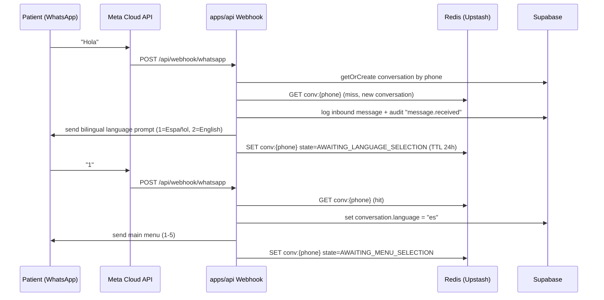
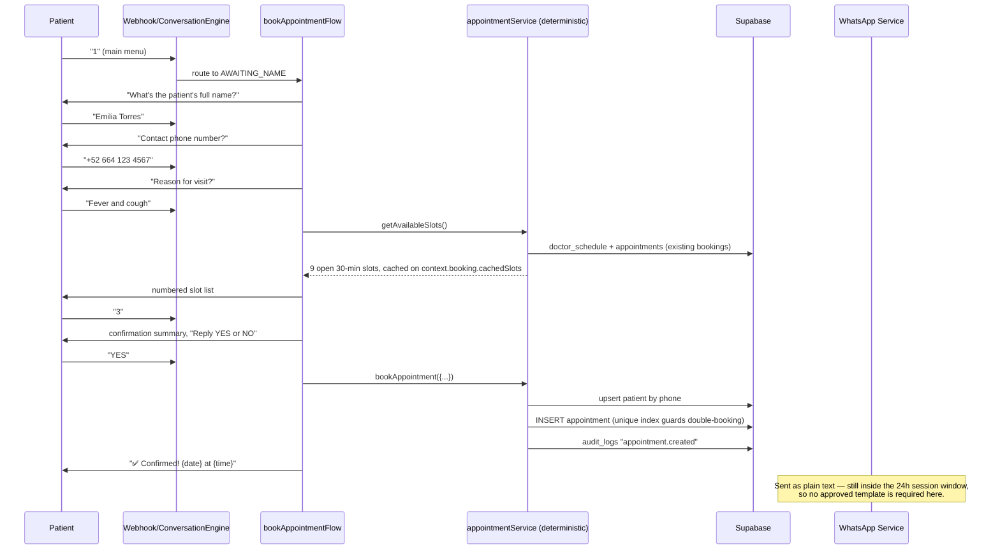
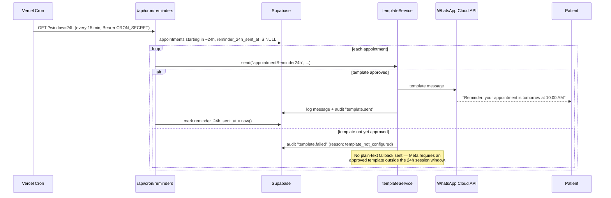
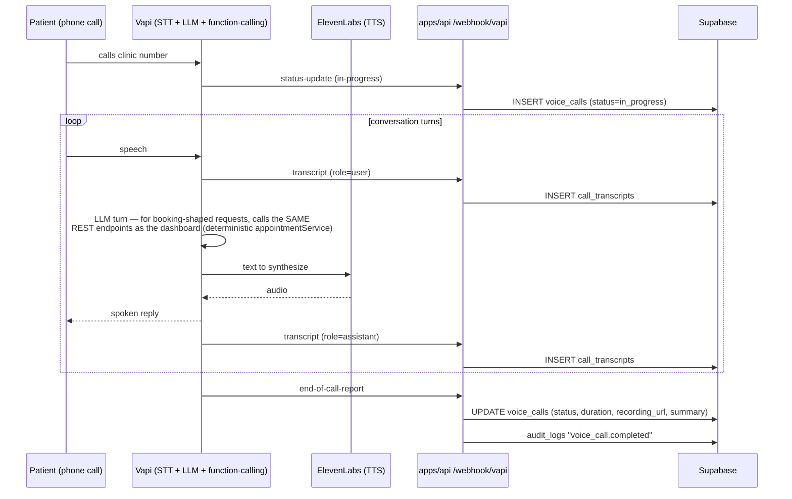

# Architecture

## Overview

VidaClinic's WhatsApp AI Receptionist is a single-clinic, single-doctor
booking system. Patients interact entirely through WhatsApp; staff manage
the clinic through a small web dashboard. The system is deliberately split
so that **AI never makes a business decision** — OpenAI classifies intent
and answers FAQs, but every appointment state transition is plain,
testable, deterministic TypeScript.

```
┌─────────────┐        ┌──────────────────────────────────────────────┐        ┌──────────────┐
│   Patient    │◄──────►│              apps/api (Express)               │◄──────►│  Supabase    │
│  (WhatsApp)  │  HTTPS │  Vercel serverless functions                  │        │  PostgreSQL  │
└─────────────┘        │                                                │        └──────────────┘
                        │  Webhook → Conversation Engine → Flows        │
                        │       │                    │                  │        ┌──────────────┐
                        │       ▼                    ▼                  │◄──────►│  Upstash     │
                        │  WhatsApp Cloud API    OpenAI (intent/FAQ)    │        │  Redis (REST)│
                        └──────────────────────────────────────────────┘        └──────────────┘
                                        ▲
                                        │ REST (Supabase Auth JWT)
                                        │
                        ┌───────────────────────────────────┐
                        │   apps/web (Vite + React)          │
                        │   Staff dashboard                  │
                        └───────────────────────────────────┘

┌─────────────┐        ┌──────────────────────────────┐
│   Patient    │◄──────►│   Vapi (voice orchestration)   │──── webhooks ──► apps/api (voice_calls, call_transcripts)
│   (phone)    │  call  │   + ElevenLabs (TTS)           │
└─────────────┘        └──────────────────────────────┘
```

## Why these specific choices

- **Upstash Redis over REST, not a TCP redis client.** Vercel functions are
  stateless and short-lived; a pooled TCP connection either leaks or
  reconnects on every cold start. Upstash's REST API turns every Redis op
  into a single HTTPS call, which is the only connection model that's
  actually safe under serverless.
- **Redis is the source of truth for conversation state, Postgres is the
  audit trail.** `conversation_states` mirrors every transition so a
  conversation can be reconstructed if a Redis key is evicted early, but the
  live routing decision never waits on Postgres.
- **OpenAI is scoped to two jobs only:** classify free text into a fixed
  `Intent` enum, and answer FAQs grounded in `clinic_settings`. It is never
  in the call path that creates, modifies, or cancels a row in
  `appointments` — see `appointmentService.ts`, which has zero AI
  dependencies and is unit-testable in isolation.
- **Templates are looked up by semantic key, never by literal string.**
  `packages/shared/templates/registry.ts` is the only file that reads
  `WHATSAPP_TEMPLATE_*` env vars. Every call site (booking flow, cron
  reminders, dashboard-triggered notifications) references
  `"appointmentConfirmation"` etc. Once Meta approves a template, filling in
  its env var is the entire required change.

## Conversation State Machine

```
AWAITING_LANGUAGE_SELECTION
        │ (1=es / 2=en)
        ▼
AWAITING_MENU_SELECTION ──1──► AWAITING_NAME ──► AWAITING_PHONE ──► AWAITING_REASON ──► AWAITING_SLOT_SELECTION ──► AWAITING_BOOKING_CONFIRMATION ──► (back to menu)
        │
        ├──2──► AWAITING_RESCHEDULE_TARGET_SELECTION ──► AWAITING_RESCHEDULE_SLOT_SELECTION ──► AWAITING_RESCHEDULE_CONFIRMATION ──► (back to menu)
        │
        ├──3──► AWAITING_CANCELLATION_TARGET_SELECTION ──► AWAITING_CANCELLATION_CONFIRMATION ──► (back to menu)
        │
        ├──4──► AWAITING_FAQ_QUESTION ──► (OpenAI FAQ answer, stays in this state until "menu")
        │
        └──5──► ESCALATED_TO_HUMAN (bot goes quiet except "menu" escape hatch)
```

Every state lives in Redis at key `conv:{phoneE164}` with a 24-hour TTL,
refreshed on every turn. See `packages/shared/src/types/conversation.ts` for
the full enum and `apps/api/src/services/redisStateService.ts` for the
get/save/recover logic.

## Sequence: First contact + language selection



## Sequence: Book appointment



## Sequence: 24h reminder (outside the session window — requires a template)



## Sequence: Voice call (Vapi + ElevenLabs)



## Repository layout

```
.
├── apps/
│   ├── api/                     # Express API, deployed as Vercel serverless functions
│   │   ├── api/index.ts         # Vercel entry point (exports the Express app)
│   │   └── src/
│   │       ├── config/          # env, supabase, redis, openai, logger
│   │       ├── middleware/      # error handling, webhook signature verification, staff auth
│   │       ├── repositories/    # one file per DB table — the only code that touches Supabase
│   │       ├── services/        # redisStateService, whatsappService, openaiService,
│   │       │                    # appointmentService (deterministic), templateService,
│   │       │                    # conversationEngine (orchestrator)
│   │       ├── flows/           # one file per WhatsApp menu flow (book/reschedule/cancel/info/human)
│   │       ├── controllers/     # webhook + dashboard REST controllers
│   │       ├── routes/          # Express routers
│   │       └── cron/            # reminder job, triggered by Vercel Cron
│   └── web/                      # React + Vite staff dashboard
├── packages/
│   └── shared/                  # DB row types, conversation state types, template registry, i18n
├── supabase/
│   └── migrations/              # SQL schema + seed data
└── docs/                        # this file, DEPLOYMENT.md, SECURITY.md, ERROR_HANDLING.md
```
